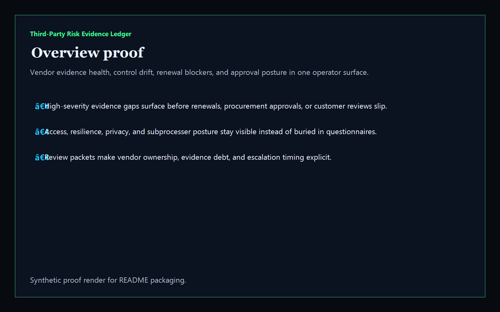
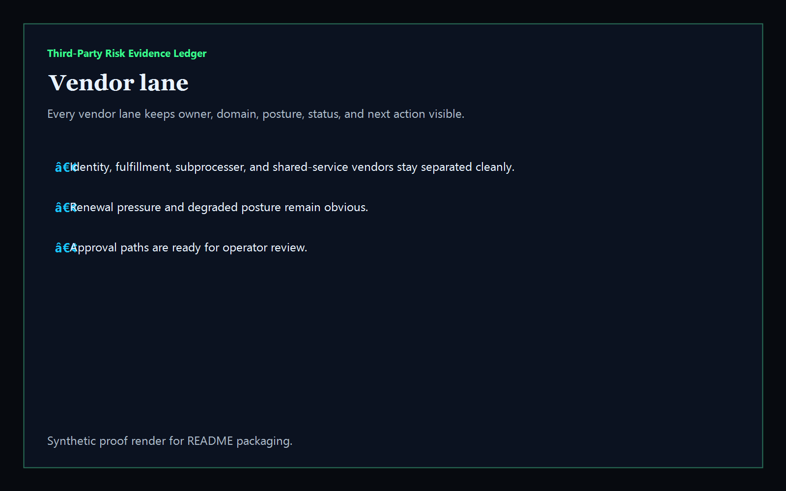
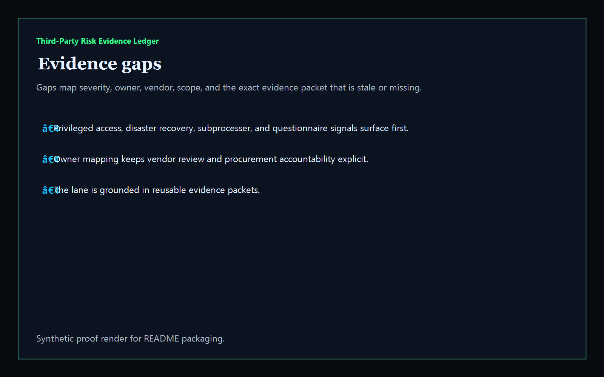
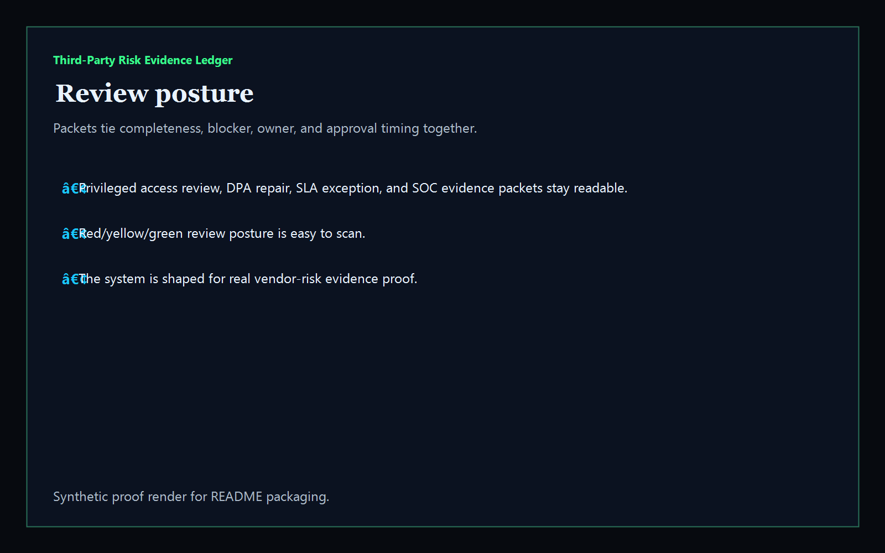

# third-party-risk-evidence-ledger

[](https://github.com/mizcausevic-dev/third-party-risk-evidence-ledger/actions/workflows/ci.yml)
[](./LICENSE)
[](https://github.com/mizcausevic-dev/third-party-risk-evidence-ledger/actions/workflows/pages.yml)

Operator control plane for third-party evidence health, access and privacy gaps, renewal workflow drift, and approval-safe decision sequencing.

## Why this exists

- Vendor reviews become dangerous when questionnaires, control proof, and exception packets stay trapped in shared folders instead of one operator-readable surface.
- Security, privacy, resilience, procurement, and subprocesser evidence need to stay visible together before renewals, sign-offs, or audit posture slip.
- Recruiters looking for `vendor risk / GRC / procurement governance / evidence operations` proof should see a real dashboard, not a keyword page.
- This repo turns vendor-risk posture data into a control plane for evidence gaps, high-severity review findings, stale approvals, and operator packet sequencing.

## Why this matters (KG Embedded tie-back)

This repo demonstrates the third-party evidence control-plane primitive for vendor-risk operations: proof coverage, review findings, workflow posture, and approval packets in one operator surface. Kinetic Gain Embedded extends this pattern into productized in-app dashboards where procurement, security, privacy, and resilience teams need evidence-rich surfaces without exposing raw contracts, questionnaires, or admin backends. See [kineticgain.com/embedded](https://kineticgain.com/embedded).

## What it shows

- `vendor-lane` visibility for access, resilience, privacy, and workflow posture in one dashboard
- `evidence-gaps` detection for degraded vendor evidence, missing proof, stale reviews, and workflow blockers
- review packets for privileged access reviews, resilience proof, privacy appendix repair, and exception sign-off
- offline-safe analysis of captured synthetic vendor risk snapshots
- recruiter-facing GRC / procurement / vendor-risk proof that complements identity governance, compliance ledgers, and security posture lanes

## Routes

- `/`
- `/vendor-lane`
- `/evidence-gaps`
- `/review-posture`
- `/verification`
- `/docs`

## API

- `/api/dashboard/summary`
- `/api/vendor-lane`
- `/api/evidence-gaps`
- `/api/review-posture`
- `/api/verification`
- `/api/sample`

## Screenshots






## CLI

```powershell
npx third-party-risk-ledger fixtures/vendor-risk.json `
    --format json|markdown|summary `
    --now 2026-05-30T00:00:00Z `
    --stale-detection-after-hours 96 `
    --fail-on-high `
    --out report.md
```

Input shape:

```json
{
  "vendors": [ ... ],
  "gaps": [ ... ]
}
```

## Local Development

```powershell
cd third-party-risk-evidence-ledger
npm install
npm run dev
```

Open:
- [http://127.0.0.1:5520/](http://127.0.0.1:5520/)
- [http://127.0.0.1:5520/vendor-lane](http://127.0.0.1:5520/vendor-lane)
- [http://127.0.0.1:5520/evidence-gaps](http://127.0.0.1:5520/evidence-gaps)
- [http://127.0.0.1:5520/review-posture](http://127.0.0.1:5520/review-posture)
- [http://127.0.0.1:5520/verification](http://127.0.0.1:5520/verification)

## Validation

- `npm run lint`
- `npm run typecheck`
- `npm run coverage`
- `npm run build`
- `npm run demo`
- `npm run smoke`
- `npm run prerender`
- `npm run render:assets`

## Production status

| Aspect | Status |
|--------|--------|
| CI | Node 20 + 22 matrix — lint · typecheck · coverage · build · demo · smoke · prerender · `npm audit` |
| License | [AGPL-3.0-or-later](./LICENSE) |
| Deploy | Static prerender -> **https://vendor.kineticgain.com/** |
| Data posture | Synthetic sample data only; no live vendor questionnaires, contracts, or production evidence packets |
| Portfolio | Part of the [Kinetic Gain Atlas](https://portfolio.kineticgain.com/) operator portfolio · apex: [kineticgain.com](https://kineticgain.com) |

## Docs

- [Kinetic Gain Embedded tie-back](./docs/KINETIC_GAIN_EMBEDDED.md)
- [Changelog](./CHANGELOG.md)

## Composes with

- [**`contract-clause-obligation-graph`**](https://github.com/mizcausevic-dev/contract-clause-obligation-graph) — contract obligation posture
- [**`regulatory-reporting-mart`**](https://github.com/mizcausevic-dev/regulatory-reporting-mart) — reporting evidence posture
- [**`detection-gap-coverage-lab`**](https://github.com/mizcausevic-dev/detection-gap-coverage-lab) — security-coverage proof

Together they form a broader recruiter-facing governance lane: vendor reviews, evidence routing, contract ownership, and approval-safe operating posture.
